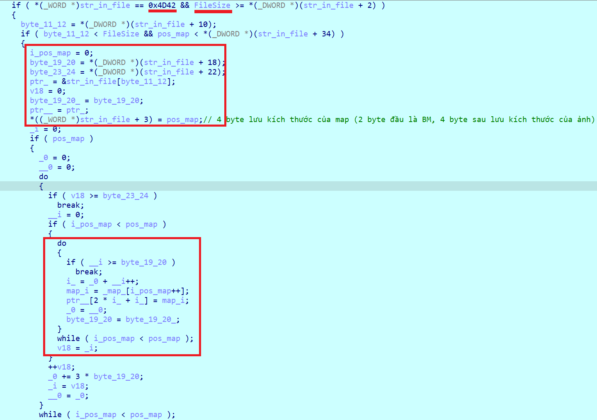
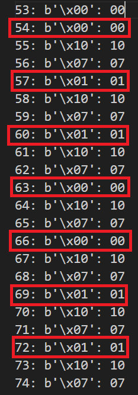
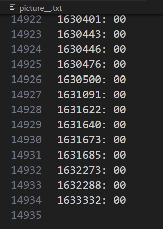
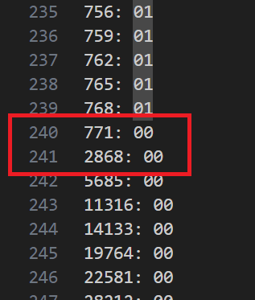
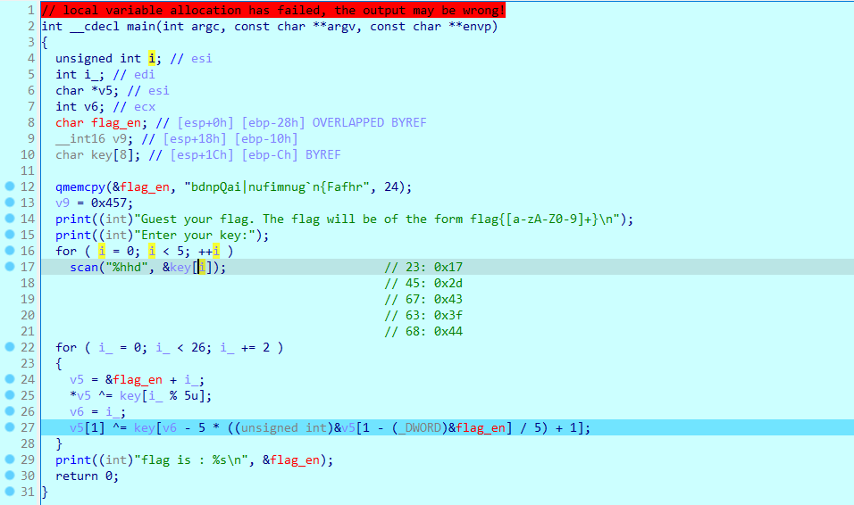
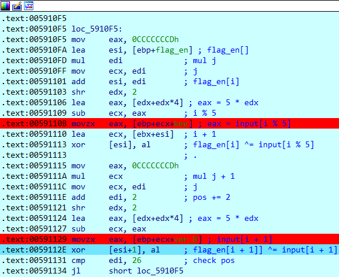

# 1_HIDDEN_TREASURE

- Chall: [Hidden Treasure](CHALL/1_HiddenTreasure.rar)

- Bài cung cấp cho ta 1 file thực thi và một 1 file ảnh.

## Phần 1: Test.

- Trong bài này thì file thực thi không yêu cầu chúng ta điền gì khi chạy chương trình nên hầu như là chúng ta sẽ phải tự đoán, mọi khi thì một là khi chạy chương trình sẽ nhập sau khi chạy chương trình hoặc là nếu truyền vào file thực thi thì nó sẽ hiện cho ta cú pháp truyền vô nhưng chall này thì không làm điều đó, điều chúng ta cần làm là đoán là chính.

- Đọc mã giả thì tui đoán bài này sẽ có 2 tham số cần truyền vào (do khi làm mấy bài truyền tham số nên tự suy ra thoai cũng không chắc chắn lắm đâu).

    

    Lúc này chắc tui đoán tham số đầu tiên (`argv[1]`) sẽ là `file` rùi tham số tiếp theo (`argv[2]`) sẽ là `key`(Tạo thử một file chạy trên IDA thì đúng là như thế thật).

    Lúc làm chall này tui vừa mò, vừa đoán, vừa thử là chính. 

- Sau tầm 1 ngày `F9` liên tục trong `IDA` tui mới có thể hiểu được cái chương trình này đang làm gì và thực hiện **đặt lại tên biến** cho phù hợp, vì cái mã giả này có nhiều đoạn cứ thừa thừa ko cần thiết, rất chi là cồng kềnh.

    

- **Phần 1**:

    

    Ở phần này, chương trình sẽ thực hiện lưu lại các bit của từng byte trong `key` mà ta truyền vào (nên ban đầu). Ví dụ `key` truyền vào là `1234` thì số `1` tương ứng với `0x31` trong mã `ASCII`, chuyển sang bit là `00110001` tuy nhiên `map` sẽ lưu ngược lại các bit là đó là `1` `0` `0` `0` `1` `1` `0` `0`.

- **Phần 2**:

    

    Lúc này ta đọc lệnh check ta thấy chương trình sẽ check 2 byte `_WORD` đầu tiên của file với `0x4D42`, vậy `0x4D42` là gì, nó là phần header của file ảnh **bmp**, đó chính là 2 kí tự `BM` và check kích thước của file với 4 byte `_DWORD` tiếp theo tính từ byte thứ 2 của file. Nếu ta tự tìm hiểu thì thấy file **bmp** sẽ có 2 byte đầu là kí tự BM rùi 4 byte tiếp theo sẽ là kích thước của file. Đến lúc này dường như chương trình đang ám chỉ là phải truyền vào file ảnh **bmp** kia vì không phải file nào cũng lưu trữ kích thước của file cả.

    Đến đoạn này tui thực hiện vừa nhìn dữ liệu trên thanh ghi trong IDA, vừa quan sát từng byte ảnh (tự lấy dữ liệu nhá), vừa xem mã máy thì có thể tóm tắt cái đoạn sau lệnh if như sau.

    - Ban đầu sẽ thực hiện lấy giá trị byte thứ 10 của file (nó có giá trị là 0x36 = 54).

        

    - Tạo một con trỏ có địa chỉ bắt đầu từ byte thứ 54 ở file trên (mấy cái byte thứ 18, 22 của file tui thấy nó chả ảnh hưởng gì đến chương trình cả, mã giả cứ khai báo rất chi là nhiều biến xong cứ gán đi gán lại mấy giá trị đấy hình như có mục đích làm rối mình hay sao ý).

        

    - Thực hiện lưu lần lượt những giá trị của map tại những vị trí mà con trỏ file bắt đầu ở vị trí thứ 54, với bước nhảy cho mỗi lần là 3. Ví dụ như trên hình thì những vị trí khoanh đỏ sẽ là những vị trí mà lưu các phần tử của `map`. (map là mảng mà lưu từng bit của key).

        
        
        

- Như vậy tóm lại, chương trình sẽ cần 2 tham số truyền vào, tham số đầu tiên là file ảnh, tham số tiếp theo là key. Chương trình sẽ thực hiện lưu key dưới dạng bit rùi lần lượt ghi những giá trị key đó vào trong file ảnh kia tại những vị trí cố định cho trước (cụ thể là từ byte thứ 54 với bước nhảy mỗi vị trí là 3).

## Phần 2: Nhặt thông tin.

- Source code đọc từng byte của ảnh:

    ```python
    def read_file():
        source_file = 'inside-the-mind-of-a-hacker-memory.bmp'
        destination_file = 'picture_.txt'

        with open(source_file, 'rb') as src, open(destination_file, 'w', encoding='utf-8') as dest:
            i = 0
            while True:
                i += 1
                byte = src.read(1)
                if not byte:
                    break
                hex_value = format(byte[0], '02x')
                dest.write(f'{i}: {byte}: {hex_value}\n')

    if __name__ == "__main__":
        read_file() 
    ```

- Như phần phân tích ở trên thì chương trình này chỉ đơn giản là ghi lại key chúng ta truyền vào file ảnh (không có mã hoá gì cả) vậy nên điều chúng ta suy nghĩ đến đầu tiên đó chính là key chính là flag và trong file ảnh này đã có flag roài. Điều chúng ta cần là lấy flag từ ảnh đoá ra. 

    Chú ý: file ảnh phải nguyên vẹn. Ban đầu tui nghĩ chương trình này là mã hoá vậy nên tui truyền key bất kì xong bị ghi đè lên vùng chứa flag và mất lun flag.

- Do ta đoán là `flag` sẽ được lưu như thế nên bây giờ ta sẽ thực hiện lấy dữ liệu từ file ảnh từ vị trí byte thứ 54, với bước nhảy là 3, chỉ lấy những byte có kí tự là 0 và 1 (do ta chưa biết được flag sẽ dài bao nhiêu kí tự cả nên sẽ lấy hết).

    ```python
    def read_file():
        source_file = 'inside-the-mind-of-a-hacker-memory.bmp'
        destination_file = 'find_flag.txt'

        with open(source_file, 'rb') as src, open(destination_file, 'w', encoding='utf-8') as dest:
            i = 0
            while True:
                byte = src.read(1)
                if not byte:
                    break
                if i >= 54 and (i - 54) % 3 == 0 and (byte == b'\x00' or byte == b'\x01'):
                    hex_value = format(byte[0], '02x')
                    dest.write(f'{i}: {hex_value}\n')
                i += 1

    if __name__ == "__main__":
        read_file() 
    ```

    Sau khi lọc xong thì ta thấy có tận `14934` byte thoả mãn điều kiện, chã nhẽ flag lại dài như thế.

    

    Nhưng khi ta thực hiện xem qua file thì ta sẽ thấy được vùng mà lưu flag đã kết thúc (byte 771), như ảnh bên dưới:

    

    Như vậy lúc này ta chỉ lấy từ byte thứ 54 đến byte thứ 771 thôi, còn từ byte 2868 thoả mãn thì ta bỏ qua. Thực hiện tính toán lại thì thấy rất là hợp lý (771 - 54) / 3 = 239. Tức là có 240 bit được lưu, tương đương với 30 byte, chiều dài flag là 30 nghe cũng thấy hợp lý đó.

## Phần 3: Tìm flag.

- Sau khi phân tích như trên roài thì tìm flag chỉ là thủ tục thoai:

    ```python
    def read_file():
        source_file = 'inside-the-mind-of-a-hacker-memory.bmp'
        ans = []
        with open(source_file, 'rb') as src:
            i = 0
            while True:
                byte = src.read(1)
                if not byte:
                    break
                if i >= 54 and (i - 54) % 3 == 0 and (byte == b'\x00' or byte == b'\x01') and i <= 771:
                    hex_value = format(byte[0], '01x')
                    ans.append(hex_value)
                i += 1
        return ans

    def _bit(map, pos):
        ans = []
        for i in range(pos, pos + 8):
            ans.append(map[i])
        ans = ans[::-1]
        return ans

    if __name__ == "__main__":
        flag = read_file()
        for i in range(0, len(flag), 8):
            ans = _bit(flag, i)
            binary = ''.join(map(str, ans))
            value = int(binary, 2)
            chr = chr(value)
            print(chr, end = '')
    ```

- Chú ý:

    1. File ảnh bmp phải là file ảnh ban đầu.

    2. Do mảng map lưu ngược nên khi mà ta lấy dữ liệu ta phải đảo lại toàn bộ 8 bit trong 1 byte.

    

- Flag: `flag{dont_forget_the_treasure}`.

# 2_F81E37E841D0B2C1D5738A7D60FD98BE

- Chall: [file](CHALL/2_F81E37E841D0B2C1D5738A7D60FD98BE.rar).

## Phần 1: Test.

- Mở mã giả và ta đọc, có thể tóm lược lại như sau:

    

- Khi chạy chương trình thì chương trình sẽ bắt chúng ta nhập key, đọc mã giả thì ta thấy key của chúng ta là `signed char` và có giá trị từ **-128** đến **127**. Vậy tức là chúng ta cần nhập đúng form của key và phải nhập 5 lần. Sau đó thì chương trình sẽ thực hiện xor từng giá trị của `flag_en` với từng giá trị của `input` chúng ta xong rùi in ra giá trị đó, và đó chính là `flag` nếu ta nhập đúng key.

- Thấy chương trình thì ra thấy có 13 vòng lặp, `flag_en[i] ^= key[i % 5]`, còn đến cái `flag_en[i + 1]` thì nó xor với một giá trị cực kì là khó đọc, nhưng ra biết nó là một phần từ của key, chạy mã máy và xem thanh ghi phát là biết ngay phần tử đó là `key[(i + 1) % 5]`.

    

- Vậy tóm lại bài sẽ bắt ta nhập 5 key (có giá trị từ **-128** đến **127**) sau đó chương trình sẽ thực hiện xor lần lượt theo quy tắc `flag_en[i] ^= key[i % 5]` và `flag_en[i + 1] ^= key[(i + 1) % 5]`. Rùi thực hiện in `flag_en` ra màn hình.

## Phần 2: Nhặt thông tin.

- Flag_en có giá trị như sau:

    ```python
    flag_en = [
        0x62, 0x64, 0x6E, 0x70, 0x51, 0x61, 0x69, 0x7C, 0x6E, 0x75, 
        0x66, 0x69, 0x6D, 0x6E, 0x75, 0x67, 0x60, 0x6E, 0x7B, 0x46, 
        0x61, 0x66, 0x68, 0x72
    ]
    ```

## Phần 3: Tìm flag.

- Do bài này chúng ta biết có cú pháp là `flag{}` nên chúng ta đã biết luôn được 5 byte sau khi thực hiện xor là `0x66`, `0x6c`, `0x61`, `0x67`, `0x7b`. Vậy lúc này ta thực hiện xor ngược lại với flag_en ở trên là có thể tìm được key.

    ```python
    print(0x66 ^ 0x62)  # key[0]
    print(0x6c ^ 0x64)  # key[1]
    print(0x61 ^ 0x6e)  # key[2]
    print(0x67 ^ 0x70)  # key[3]
    print(0x7b ^ 0x51)  # key[4]
    ```

    

- Flag: `flag{easy_baby_challenge}`.

- **Bonus:**

    

    Khi nhìn vào `v5[1]` thực sự là tui chả hiểu nó đang làm gì nhưng sau khi tham khảo wu của đchi Vũ Hải Sơn thì đchi đó có một cách giải thích cho dòng này tui thấy khá là hay và bổ ích.

    ```python  
        v6 - 5 * (&v5[1 - &flag_en] / 5) + 1
    ->  i - 5 * (&flag_en + i + 1 - flag_en) / 5 + 1
    ->  i - 5 * (i + 1) / 5 + 1
    ->  [i + 1] - [5 * (i + 1) / 5]
    ->  (i + 1) % 5
    ```

# 3_PUZZLE

- Chall: [FILE](CHALL/3_PUZZLE.rar).

## Phần 1: Test.

- Bài này cho chúng ta file thư viện `.dll` thay vì cho chúng ta file thực thi, lúc ta ném vào IDA thì thấy trong thư viện có một hàm `check`:

    

- Khi ta click vào thì dường như đây là một chương trình check input đầu vào:

    

- Và đây là nội dung của hàm `func_en`:

    

    Hàm `func_xor`:

    

- Đến đây tui thấy hơi khó nếu mà không debug nên tui chọn cách sẽ tạo một chương trình C đơn giản rùi import thư viện vào gọi hàm check rùi tiến hành debug từ file thực thi đóa.

    ```C
    #include <windows.h>
    #include <stdio.h>
    #include <stdbool.h> 
    #include <stdlib.h>

    // Định nghĩa con trỏ hàm với kiểu trả về và tham số phù hợp với hàm check
    typedef bool (*CheckFunction)(const char*);

    int main() {
        // Tải thư viện Puzzle_v2.dll
        HMODULE hDll = LoadLibrary("Puzzle_v2.dll");
        
        // Lấy địa chỉ hàm check từ Puzzle_v2.dll
        CheckFunction check_func = (CheckFunction)GetProcAddress(hDll, "check");

        char input[100];
        printf("Flag: ");
        gets(input);

        // Gọi hàm check_t và kiểm tra kết quả
        int result = check_func(input);
        if (result) printf("Correct :>\n");
        else printf("Wrong :<\n");

        // Giải phóng thư viện
        FreeLibrary(hDll);
        return 0;
    }
    ``` 

    - Lấy file thực thi ra và tiến hành debug (chú ý khi mà debug nhớ để file `.dll` cùng thư mục với thư mục chứa file thực thi).

## Phần 2: Nhặt thông tin.

- Chú ý khi nhặt thông tin ra thì ta nhặt từ file `.dll` chứ không nhặt từ file thực thi, tại vì khi tui tìm ra flag tui thấy có sự khác nhau nho nhỏ giữa dữ liệu ở 2 file này và tui cũng không hiểu vì sao lại có sự khác nhau đóa.

- Ví dụ minh họa như sau:

    

    

- Nên ta sẽ lấy thông tin từ file `.dll` này.

## Phần 3: Tìm flag.

- Sau khi chúng ta thực hiện đeub thì chúng ta có thể tóm tắt lại như sau. Ban đầu chương trình sẽ lấy các phần tử của `map` xor với `0xAB`, lấy lần lượt 16 byte đầu tiên của `input` rùi thực hiện **xor** nó với `cipher`, xong lấy kết quả xor tiếp với `map`, cập nhật `cipher` là kết quả với `xor` xong, rùi cứ tiếp tục làm như thế đến phần từ cuối cùng của `input`.

- Chương trình được mô phỏng bằng ngôn ngữ python như sau:

    ```python
    input = [
        0x74, 0x75, 0x6e, 0x67, 0x64, 0x65, 0x70, 0x74, 0x72, 0x61, 
        0x69, 0x63, 0x6f, 0x6d, 0x6f, 0x74, 0x6b, 0x68, 0x6f, 0x6e, 
        0x67, 0x63, 0x75, 0x67, 0x61, 0x73, 0x67, 0x73, 0x61, 0x73, 
        0x64, 0x64
    ]   # tungdeptraicomotkhongcugasgsasdd

    map = [
        0x9B, 0x93, 0x9C, 0x9E, 0x9D, 0x92, 0x98, 0x99, 0x9F, 0x9F, 
        0x93, 0x9E, 0x98, 0x92, 0x9D, 0xAB
    ]

    flag_en = [
        0x22, 0x35, 0x31, 0x05, 0xA3, 0x28, 0x88, 0x21, 0x81, 0x6C, 
        0x64, 0x6D, 0xE3, 0x42, 0xB8, 0x2C, 0x67, 0x52, 0x60, 0x55, 
        0xF0, 0x7D, 0xE4, 0x7D, 0xDA, 0x2F, 0x21, 0x00, 0x00, 0x00,
        0x00, 0x00
    ]

    cipher = [
        0x59, 0x40, 0x47, 0x73, 0xC1, 0x57, 0xC0, 0x7B, 0xDA, 0x2F, 
        0x03, 0x3C, 0xBF, 0x24, 0xF7, 0x43
    ]

    def enc(key, input, cipher):
        for i in range(16): key[i] = input[i] ^ cipher[i]

    if __name__ == "__main__":
        for i in range(len(map)): map[i] ^= 0xAB
        key = [0] * 16
        ans = []
        for i in range(0, len(input), 16):
            input_ = input[i: i + 16: 1]
            enc(key, input_, cipher)
            enc(key, key, map)
            cipher = key
            ans += cipher
        for i in ans: print(f'0x{i:02x}', end = ' ')
    ```

- Để tìm được flag thì ta thấy rằng cứ đoạn input encrypt ở phía sau lại dựa vào đoạn input encrypt ở đằng trước đó nên việc làm ngược lại là khả thi chứ ko phải `tấn công vũ phu` hay gọi là `vét cạn`.

    ```python
    map = [
        0x9B, 0x93, 0x9C, 0x9E, 0x9D, 0x92, 0x98, 0x99, 0x9F, 0x9F, 
        0x93, 0x9E, 0x98, 0x92, 0x9D, 0xAB
    ]

    flag_en = [
        0x22, 0x35, 0x31, 0x05, 0xA3, 0x28, 0x88, 0x21, 0x81, 0x6C, 
        0x64, 0x6D, 0xE3, 0x42, 0xB8, 0x2C, 0x67, 0x52, 0x60, 0x55, 
        0xF0, 0x7D, 0xE4, 0x7D, 0xDA, 0x2F, 0x21, 0x00, 0x00, 0x00,
        0x00, 0x00
    ]

    cipher = [
        0x59, 0x40, 0x47, 0x73, 0xC1, 0x57, 0xC0, 0x7B, 0xDA, 0x2F, 
        0x03, 0x3C, 0xBF, 0x24, 0xF7, 0x43
    ]

    def enc(key, input, cipher):
        for i in range(16): key[i] = input[i] ^ cipher[i]

    if __name__ == "__main__":
        for i in range(len(map)): map[i] ^= 0xAB

        for i in range(16):
            print(f'{chr((flag_en[i] ^ map[i]) ^ cipher[i])}', end = '')
        for i in range(11):
            print(f'{chr((flag_en[16 + i] ^ map[i]) ^ flag_en[i])}', end = '')
    ```

- Flag: `KMACTF{how_do_you_feel_now}`.

- Chú ý: nếu ở ở map của bạn phần tử kia bạn lấy trong file thực thi mà chúng ta tự tạo thì sẽ ra kết quả là: `KMACTF{how^do_you_feel_now|` và nó ko phải là flag.