# Dynamic_Function

- Chall: [file RAR](chall/rev_dynamic_function.rar)

- Đọc qua mã giả của bài này thì thấy như sau:

    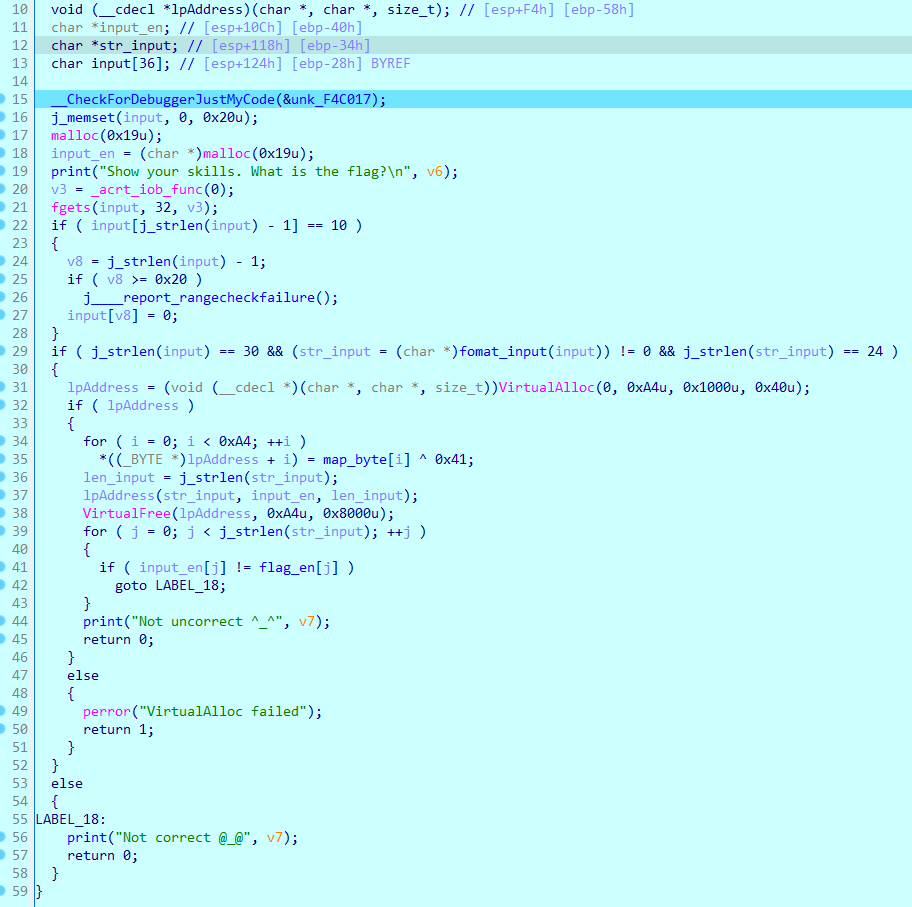

    Chương trình thực hiện check chiều dài của chuỗi với `30` xong rùi thực hiện tách `KCSC{` và `}` ra rùi thực hiện check chiều dài của nội dung của nó với `24`.

- Ở phần tiếp theo, chương trình cấp phát một vùng nhớ ảo cho biến `lpAddress`, sau đó `xor` từng byte với `0x41`. Lúc này `lpAddress` đã trở thành `1 hàm` và sau đó chương trình gọi đến hàm này (chắc có lẽ vì đây là bài có tên là **Dynamic Function**).

    

- Đến đây là thực hiện nhảy vô hàm lpAddress xem nội dụng của hàm là gì:

    

    Đến lúc này ta nhấn chuột phải chọn `Create Function` hoặc bôi đen nhấn `P`:

    

    Ta thấy chương trình sẽ thực hiện mã hoá flag bằng hàm lpaddress roài thực hiện so sánh với `flag_en`, như sau:

    

    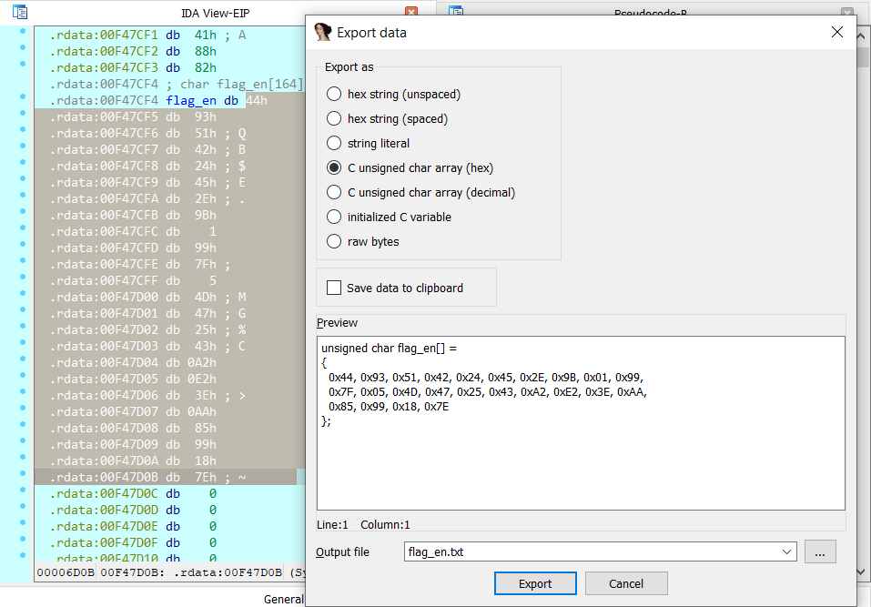

- Tui thấy mấu chốt bài này đó chính là chúng ta biết lpAddress là một hàm và biết cách để đọc nội dung hàm đó thoai chứ về phần mã hoá input thì khá dễ dàng, các bạn có thể tham khảo source python.

    ```python
    flag_en = [
        0x44, 0x93, 0x51, 0x42, 0x24, 0x45, 0x2E, 0x9B, 0x01, 0x99, 
        0x7F, 0x05, 0x4D, 0x47, 0x25, 0x43, 0xA2, 0xE2, 0x3E, 0xAA, 
        0x85, 0x99, 0x18, 0x7E
    ]

    RIPC = [
        0x72, 0x65, 0x76, 0x65, 0x72, 0x73, 0x69, 0x6E, 0x67, 0x5F, 
        0x69, 0x73, 0x5F, 0x70, 0x72, 0x65, 0x74, 0x74, 0x79, 0x5F, 
        0x63, 0x6F, 0x6F, 0x6C
    ]   # reversing_is_pretty_cool

    for i in range(len(flag_en)): flag_en[i] ^= RIPC[i]
    for i in range(len(flag_en)):
        for j in range(256):
            if flag_en[i] == 16 * (j % 16) + j // 16: print(chr(j), end = '')
    ```

- Flag: `KCSC{correct_flag!submit_now!}`.

# Two_Faces.

- Chall: [FILE](chall/rev_two_faces.rar).

- Đọc qua mã giả thì chúng ta có thể tóm tắt lại  chương trình như sau:

    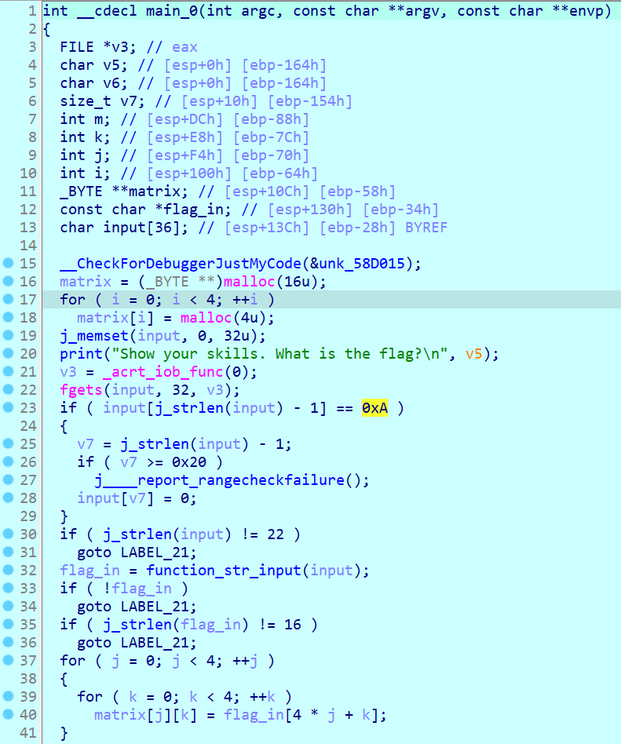

    Chương trình yêu cầu chúng ta nhập `input`, kiểm tra chiều dài input với `22` hay không, sau đó loại bỏ phần `KCSC{` và `}` từ input, rùi thực hiện kiểm tra với `16`, xong rùi đưa các kí tự lần lượt vào một ma trận (mảng 2 chiều) cỡ `4x4`. 

    

    Về phần này thì chương trình sẽ gọi các hàm function1, 2, 3, 4 thực hiện 100 lần với chức năng của các hàm như sau:

    - `function_1`: xoay **trái** các hàng của matrix theo thứ tự của hàng đó.

        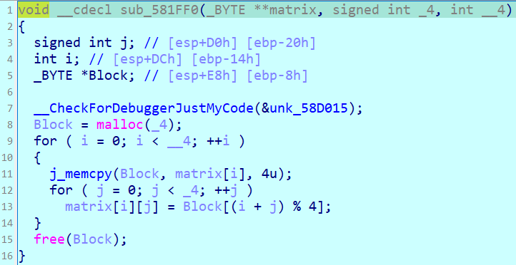

        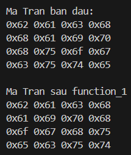

    - `function_2:` xoay **lên** các cột của matrix theo thứ tự của cột đó.

        

        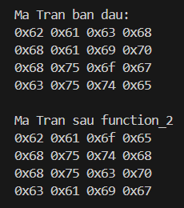

    - `function_3`: đảo 4 bit đầu và 4 bit cuối của mỗi phần tử trong matrix.

        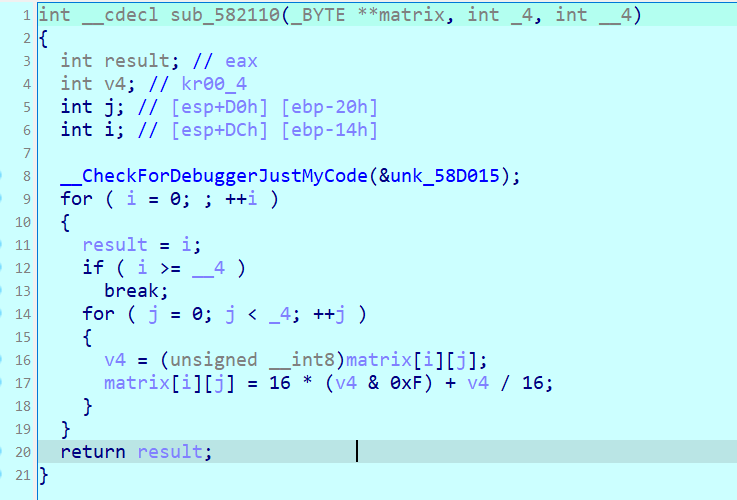

        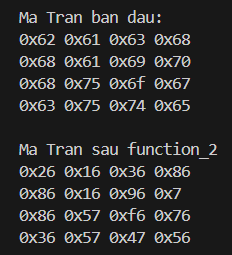

    - `function_4`: xor từng phần tử của matrix với m + 88 (với m là chỉ số của vòng lặp hiện tại).

        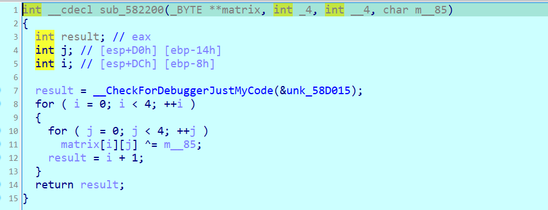

    Sau đó đến phần `check_flag`, chương trình sẽ chuyển những giá trị của mỗi phần tử trong matrix thành những kí tự, ví dụ `0xFA` thì chuyển thành kí tự `F` và `A` xong gán vô `str1`, sau đó so sánh `str1` với `FDA6FF91ADA0FDB7ABA9FB91EFAFFAA2`:

    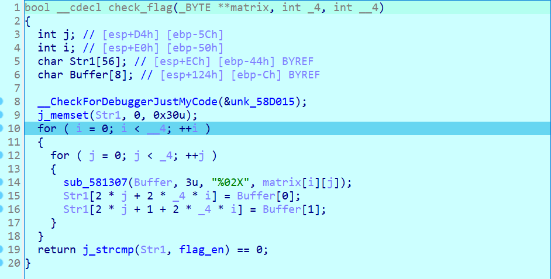

- Thực hiện viết sc:

    ```python
    flag_en = [
        0xFD, 0xA6, 0xFF, 0x91, 0xAD, 0xA0, 0xFD, 0xB7, 0xAB, 0xA9, 
        0xFB, 0x91, 0xEF, 0xAF, 0xFA, 0xA2
    ]

    def matrix_(data):
        ans = []
        for i in range(4):
            tmp = []
            for j in range(4): tmp.append(data[4 * i + j])
            ans.append(tmp)
        return ans

    def function1_rev(matrix):
        for i in range(4):
            tmp = matrix[i][:]
            for j in range(4): 
                matrix[i][j] = tmp[(4 - i + j) % 4]

    def function2_rev(matrix):
        for i in range(4):
            tmp = []
            for j in range(4): tmp.append(matrix[j][i])
            for j in range(4): matrix[j][i] = tmp[(4 - i + j) % 4]

    def function3_rev(matrix):
        for i in range(4):
            for j in range(4):
                tmp = matrix[i][j]
                matrix[i][j] = 16 * (tmp & 0xF) + tmp // 16

    def function4_rev(matrix, num):
        for i in range(4):
            for j in range(4): matrix[i][j] ^= num

    if __name__ == "__main__":
        matrix = matrix_(flag_en)
        for i in range (99, -1, -1):
            function4_rev(matrix, i + 85)
            function3_rev(matrix)
            function2_rev(matrix)
            function1_rev(matrix)
        for i in range(4):
            for j in range(4): print(chr(matrix[i][j]), end = '')

    ```

- Thu được kết quả là `KCSC{3a5y_ch41leng3_!}`. Thử lại thì thấy chương trình hiện sai.

    

- Sau một hồi `debug` thì hoá ra bài này có gọi một hàm trước hàm main đó chính là hàm `TlsCallback0_0`, trong hàm này có một hàm check là `debugger` hay không.

    

- Phân tích kĩ đoạn này một chút:

    

    **Src[0] = (int)sub_58133E:** Đây là gán địa chỉ của hàm `sub_58133E` vào phần tử đầu tiên của mảng `Src`.

    **v4 = 0x68:** Gán giá trị thập lục phân `0x68` cho biến `v4`.

    **v5[4] = 0xC3:** Gán giá trị `0xC3` cho phần tử thứ năm của mảng `v5`. `0xC3` là mã lệnh `RET` trong ASM, dùng để kết thúc một hàm.
    
    **j_memcpy(v5, Src, 4u):** Sao chép `4` byte từ Src sang `v5`. Sau dòng này, `v5` sẽ chứa địa chỉ của hàm `sub_58133E` trong `4` byte đầu tiên.

    **dwSize = 6:** Gán giá trị `6` cho `dwSize`. Đây là kích thước của vùng bộ nhớ mà chúng ta sẽ thay đổi quyền truy cập.
    
    **lpAddress = j_strcmp:** Gán địa chỉ của hàm `j_strcmp` cho `lpAddress`.

    **v7 = VirtualProtect(j_strcmp, 6u, 0x40u, flOldProtect):** Thay đổi quyền truy cập của 6 byte tại địa chỉ của hàm `j_strcmp` sang `PAGE_EXECUTE_READWRITE` (`0x40u`). Lưu quyền truy cập cũ vào `flOldProtect`.

    - `0x40u` (hay `PAGE_EXECUTE_READWRITE`) nghĩa là bạn muốn cho phép thực thi, đọc và ghi vào vùng bộ nhớ này.
    
    **return j_memcpy(lpAddress, &v4, dwSize):** Sao chép `6` byte từ địa chỉ của `v4` sang `lpAddress` (địa chỉ của hàm `j_strcmp`).
    
    - Nếu mà nhìn từ trên xuống nãy giờ thì kích thước vùng ô nhớ của v4 bây giờ sẽ là mã sau:

        ```asm
        push sub_41133E
        ret
        ```

- Như vậy, Mã này có thể được sử dụng để khi mà ta gọi `j_strcmp`, chương trình thực tế sẽ nhảy đến hàm `sub_58133E` thay vì thực thi mã gốc của `j_strcmp`.

- Thực hiện jump IP để nhảy vô câu lệnh trong if hoặc thực hiện sửa cờ để check lại.

    

    Như vậy thì đây mới chính là hàm check flag thực sự. Ta thực hiện sửa một chút source code để tìm flag thoai.

    ```python
    flag_en = [
        0x46, 0x44, 0x41, 0x36, 0x46, 0x46, 0x39, 0x31, 0x41, 0x44, 
        0x41, 0x30, 0x46, 0x44, 0x42, 0x37, 0x41, 0x42, 0x41, 0x39, 
        0x46, 0x42, 0x39, 0x31, 0x45, 0x46, 0x41, 0x46, 0x46, 0x41, 
        0x41, 0x32
    ]   # FDA6FF91ADA0FDB7ABA9FB91EFAFFAA2

    v7 = [
        0x07, 0x7C, 0x00, 0x07, 0x7F, 0x77, 0x78, 0x01, 0x00, 0x73, 
        0x07, 0x75, 0x00, 0x02, 0x03, 0x73, 0x07, 0x07, 0x00, 0x0C, 
        0x07, 0x72, 0x7B, 0x70, 0x04, 0x7F, 0x03, 0x04, 0x07, 0x71, 
        0x00, 0x04
    ]

    for i in range(32):
        if i % 2 == 0: print(end = '0x')
        print(chr(flag_en[i] ^ v7[i]), end = '')
        if i % 2 == 1 and i != 31: print(end = ', ')
    ```

    Ta ném output vừa rùi vào phần `flag_en` của source code phía trên là sẽ được flag là: `function_h00k1ng`

    ```python
    flag_en = [
        0xA8, 0xA1, 0x91, 0xA0, 0xA7, 0xFE, 0xFF, 0xAD, 0xFE, 0xA5, 
        0xA0, 0xBA, 0xA9, 0xBB, 0xA0, 0xA6
    ]

    def matrix_(data):
        ans = []
        for i in range(4):
            tmp = []
            for j in range(4): tmp.append(data[4 * i + j])
            ans.append(tmp)
        return ans

    def function1_rev(matrix):
        for i in range(4):
            tmp = matrix[i][:]
            for j in range(4): 
                matrix[i][j] = tmp[(4 - i + j) % 4]

    def function2_rev(matrix):
        for i in range(4):
            tmp = []
            for j in range(4): tmp.append(matrix[j][i])
            for j in range(4): matrix[j][i] = tmp[(4 - i + j) % 4]

    def function3_rev(matrix):
        for i in range(4):
            for j in range(4):
                tmp = matrix[i][j]
                matrix[i][j] = 16 * (tmp & 0xF) + tmp // 16

    def function4_rev(matrix, num):
        for i in range(4):
            for j in range(4): matrix[i][j] ^= num

    if __name__ == "__main__":
        matrix = matrix_(flag_en)
        for i in range (99, -1, -1):
            function4_rev(matrix, i + 85)
            function3_rev(matrix)
            function2_rev(matrix)
            function1_rev(matrix)
        for i in range(4):
            for j in range(4): print(chr(matrix[i][j]), end = '')
    ```

# Awg_Mah_Back

- Chall: [FILE](chall/Awg_Mah_Back_DONE.rar).

- Bài này cung cấp cho ta một file python và một file txt. File python có nội dung như sau:

    ```python
    from pwn import *

    with open('flag.txt', 'rb') as (f):
        flag = f.read()
    a = flag[0:len(flag) // 3]
    b = flag[len(flag) // 3:2 * len(flag) // 3]
    c = flag[2 * len(flag) // 3:]
    a = xor(a, int(str(len(flag))[0]) + int(str(len(flag))[1]))
    b = xor(a, b)
    c = xor(b, c)
    a = xor(c, a)
    b = xor(a, b)
    c = xor(b, c)
    c = xor(c, int(str(len(flag))[0]) * int(str(len(flag))[1]))
    enc = a + b + c
    with open('output.txt', 'wb') as (f):
        f.write(enc)
    ```

- Chương trình sẽ thực hiện đọc dữ liệu trong file flag.txt rùi chia nội dung làm 3 phần, ban đầu mã hóa phần a với một số nguyên (là tổng hai chữ số đầu tiên trong độ dài của flag), sau đó mã hóa lần lượt b, c, a, b, c, c như trên xong lưu kết quả vào output.txt. Đề bài cho ta file output.txt. Như vậy ta chỉ cần làm ngược lại quá trình là xong.

- Source code: 

    ```python
        from pwn import *

        with open('output.txt', 'rb') as (f):
            flag = f.read()
        a = flag[0:len(flag) // 3]
        b = flag[len(flag) // 3:2 * len(flag) // 3]
        c = flag[2 * len(flag) // 3:]
        c = xor(c, int(str(len(flag))[0]) * int(str(len(flag))[1]))
        c = xor(b, c)
        b = xor(a, b)
        a = xor(c, a)
        c = xor(b, c)
        b = xor(a, b)
        a = xor(a, int(str(len(flag))[0]) + int(str(len(flag))[1]))
        enc = a + b + c
        print(end)
    ```

- Flag: **KCSC{84cK_t0_BaCK_To_B4ck_X0r`_4nD_864_oM3g4LuL}**

# Dont_Call_Me_Kamui_DONE

- Chall: [FILE](KCSC_RECRUITMENT_2023\chall\chal.rar).

- Ban đầu mình thực hiện đọc mã giả của bài này để xem sao:

    

- Trong hàm `flag_en` như sau:

    

    Trong phần khởi tạo biến có các giá trị như là `0x6A09E667`, `0xBB67AE85`, `0x3C6EF372`, `0xA54FF53A`, `0x510E527F`, `0x9B05688C`, `0x1F83D9AB`, `0x5BE0CD19`. Sau một hồi tra google và tham khảo thì mình thấy những giá trị này thường liên quan đến các hằng số khởi tạo của các thuật toán băm mật mã như `SHA-256`.

    Thế là mình thực hiện lun nhảy vô cái hàm trong hàm main mà bỏ qua không đi sâu vào hàm flag_en này mà thực hiện kiểm tra xem những gì mình đoán có là đúng hay không bằng việc check mã hóa input của mình từ chương trình và trên website Sha256 Encrypt.

    

    

    Như vậy có thể thấy việc đoán hàm trên là mã hóa sha256 là cũng gần như là đúng, do việc viết decrypter sha256 không phải là một điều dễ dàng nhưng chúng ta cứ thử với cái string mà được strcmp với input xem sao: `1cf18a243c25a56a993c8207d1161a9c2de5f34b952d382704b94dc5e888b108`.

    

- Sau khi quăng lên web thì ta được key là `goldfish`.

    

- Ta được flag sau:
    
    

- Flag: `KCSC{het_y_tuong_roi_nen_di_an_trom_idea_KMACTF_hjhj}`

# Ez_Ceasar

- Chall: [FILE](chall/source.rar).

- Bài này cung cấp cho ta một file python có nội dung như sau:

    ```python
    import string
    import random

    alphabet = string.ascii_letters + string.digits + "!{_}?"

    flag = 'KCSC{s0m3_r3ad4ble_5tr1ng_like_7his}'
    assert all(i in alphabet for i in flag)

    key = random.randint(0, 2**256)

    ct = ""
    for i in flag:
        ct += (alphabet[(alphabet.index(i) + key) % len(alphabet)])

    print(f"{ct=}")

    # ct='ldtdMdEQ8F7NC8Nd1F88CSF1NF3TNdBB1O'
    ```

- Đọc qua thì ta thấy bài này sẽ thực hiện dịch kí tự của flag sang key kí tự bên phải với key được random từ chương trình, trong đó mảng được dịch là mảng alphabet. Nhìn vô đề thì thấy key là random từ 0 đến 2**256, nhìn thì có vẻ to nhưng àm thực chất nó giá trị của nó chỉ từ 0 đến 66. Vì chúng ta có % len(alphabet) nên giá trị của nó chỉ nằm từ 0 đến 66 thoai. Ta thực hiện viết source thì key rùi cho cố định key tìm flag là xong (Tìm key dựa trên chữ `K` trong cú pháp và chữ `l` ở ct).

- Tìm key:

    ```python
    import string

    alphabet = string.ascii_letters + string.digits + "!{_}?"

    for key in range(67):
        if "K" == (alphabet[(alphabet.index("l") + key) % len(alphabet)]): print(key)
    ```

    key = 25.

- Tìm flag:

    ```python
    import string

    alphabet = string.ascii_letters + string.digits + "!{_}?"

    flag = 'ldtdMdEQ8F7NC8Nd1F88CSF1NF3TNdBB1O'
    assert all(i in alphabet for i in flag)

    key = 25

    ct = ""
    for i in flag:
        ct += (alphabet[(alphabet.index(i) + key) % len(alphabet)])

    print(f"{ct=}")
    ```

- Flag: `KCSC{C3as4r_1s_Cl4ss1c4l_4nd_C00l}`.

# Hide_and_seek

- Chall: [FILE](chall/rev_hide_and_seek.rar).

- Khi chạy thử bài này trên cmd thì ta thấy như sau:

    

- Có vẻ như bài này ko bắt chúng ta phải nhập flag mà tự để chúng ta đi tìm, mía chương trình chạy xong là tự động viết moojy file vào máy tính của mình, rén z ò ra. Sau chall này là tui ko dám để chế độ Local khi debug nữa.

- Mở IDA ra mà mem theo những câu lệnh để in ra cái đoạn mà đã bị màu xanh kia che mất thoai. Thì chúng ta đến được đây:

    

    Lúc này dường như có một đoạn in đường dẫn nơi mà ta có thể tìm flag:

    

- Thực hiện lấy dữ liệu rùi sử lý thoai.

    ```python
    tmp = [
    0x3A, 0x00, 0x5C, 0x00, 0x55, 0x00, 0x73, 0x00, 0x65, 0x00, 
    0x72, 0x00, 0x73, 0x00, 0x5C, 0x00, 0x44, 0x00, 0x45, 0x00, 
    0x4C, 0x00, 0x4C, 0x00, 0x5C, 0x00, 0x41, 0x00, 0x70, 0x00, 
    0x70, 0x00, 0x44, 0x00, 0x61, 0x00, 0x74, 0x00, 0x61, 0x00, 
    0x5C, 0x00, 0x4C, 0x00, 0x6F, 0x00, 0x63, 0x00, 0x61, 0x00, 
    0x6C, 0x00, 0x5C, 0x00, 0x54, 0x00, 0x65, 0x00, 0x6D, 0x00, 
    0x70, 0x00, 0x5C, 0x00, 0x2E, 0x20, 0x74, 0x00, 0x65, 0x00, 
    0x6D, 0x00, 0x70, 0x00, 0x5F, 0x00, 0x68, 0x00, 0x74, 0x00, 
    0x6D, 0x00, 0x6C, 0x00, 0x5F, 0x00, 0x66, 0x00, 0x69, 0x00, 
    0x6C, 0x00, 0x65, 0x00, 0x5F, 0x00, 0x31, 0x00, 0x30, 0x00, 
    0x33, 0x00, 0x37, 0x00, 0x37, 0x00, 0x39, 0x00, 0x36, 0x00, 
    0x2E, 0x00, 0x68, 0x00, 0x74, 0x00, 0x6D, 0x00, 0x6C
    ]

    for i in range(len(tmp)):
        if tmp[i] != 0: print(chr(tmp[i]), end = '')
    ```

    Ta được như sau: `:\Users\DELL\AppData\Local\Temp\. temp_html_file_1037796.html`.

    

    

- Flag: `KCSC{~(^._.)=^._.^=(._.^)~}`.

# Image

- Chall: [FILE](chall/Images.rar).

- Bài này cho chúng ta 12 file ảnh mà chúng ta phải ngồi đọc mã giả. Mã giả bài này chỉ đơn giản là lấy từng giá trị của buffer thứ i rùi thực hiện so sánh với giá trị cho trước mà thoai, tui có ngồi lọc 12 cái ảnh đó ra ta được giá trị của những khí tự trong buffer nhưu sau:

    ```txt
    0 75
    1 67
    2 83
    3 67
    4 123
    5 67
    6 97
    7 109
    8 95
    9 111
    10 110
    11 95
    12 118
    13 105
    14 95
    15 100
    16 97
    17 95
    18 107
    19 105
    20 101
    21 110
    22 95
    23 110
    24 104
    25 97
    26 110
    27 95
    28 110
    29 104
    30 105
    31 110
    32 95
    33 104
    34 101
    35 116
    36 95
    37 100
    38 111
    39 110
    40 103
    41 95
    42 97
    43 110
    44 104
    45 95
    46 110
    47 97
    48 121
    49 96
    50 125
    ```

    ```python
    a = [-1] * 51

    for i in range(51):
        num1, num2 = map(int, input().split())
        a[num1] = num2

    for i in range(len(a)): print(chr(a[i]), end = '')
    ```

- Flag: **KCSC{Cam_on_vi_da_kien_nhan_nhin_het_dong_anh_nay`}**.

# Real_Warmup.

- Chall: [FILE](chall/chall.rar).

- Mở mã giả nên ta thấy có vẻ như chuỗi là dạng mã hóa base64.

    

    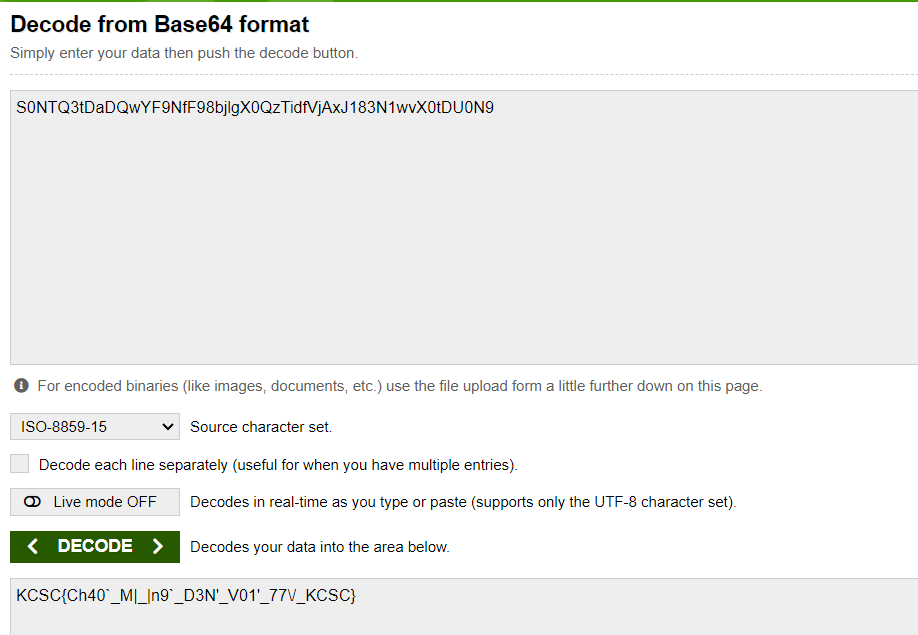

- Flag: 

    ```
    KCSC{Ch40`_M|_|n9`_D3N'_V01'_77\/_KCSC}
    ```

# The_Ultimate_Xor

- Chall: [FILE](chall/asm.rar).

- Bài này cho chúng ta một file txt chứa mã ASM, nhưng mà điều quan trọng là file này chứa tận hơn 9000 dòng. Khóc mất thoai.

    

- Bây giờ chúng ta thực hiện phân tích những dòng mã máy đầu tiên:

    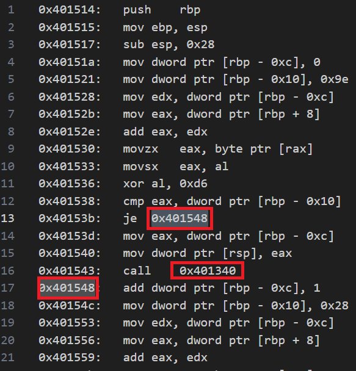

    Chúng ta thấy rằng trước dòng 13 mà dòng 12 thực hiện lệnh so sánh eax với một giá trị nào đó, nếu mà bằng thì thực hiện nhảy đến địa chỉ kia (thật bất ngờ là địa chỉ nó ngay ở bên dưới), nếu không thì nó sẽ nhảy đến địa chỉ `0x401340` (khi tui click vô đây thì tui thấy rằng ko có dòng địa chỉ đó trong FILE này), lúc này tui đoán là cái địa chỉ `0x401340` trả về địa chỉ của một hàm nào đó để biết là so sánh sai, còn cụ thể nào như nào thì chúng ta ko biết. 
    
    

    Địa chỉ của hàm này xuất hiện `715` lần và luôn ở đằng sau câu lệnh `cmp` (hãy để ý đến con số 715 này vì tý nữa nó sẽ giúp ta check một số điều trong file này).

    Vậy đến đây là chúng ta có thể có một phán đoán là nếu mà đúng thì nó nhảy tiếp và sai thì nó sẽ nhảy đến địa chỉ một hàm thông báo là sai (và địa chỉ của hàm đó ko có trong file này nên chúng ta không cần quan tâm). Vậy chúng ta cần quan tâm là làm sao để nó nhảy tiếp đến cái dòng tiếp theo.

- Ta nhận thấy tiếp theo là trong file này thì mặc dù có tận hơn 9000 dòng code nhưng mà không phải các đong đều khác nhau mà chúng cho chung một motip như sau:

    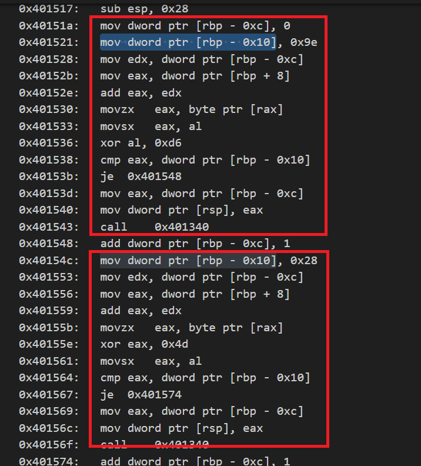

    Ta thấy lệnh đưa giá trị vào con trỏ `[rbp - 0x10]`, đưa một giá trị nào đó vào thanh eax rùi thực hiện xor nó với giá trị 0xd6 rùi kiểm tra với giá trị trong `[rbp - 0x10]`. Như vậy ta thử xem những thứ trong thanh eax là gì (Lúc tui nhập vài giá trị đầu tiên thì tui đã đoán được chương trình này làm như thế nào roài).

    ```C
    #include<stdio.h>

    int main(){
        int a[1000];
        int pos = -1, m, n, ans;
        while (1){
            scanf("%x%x", &m, &n);
            ans = m ^ n;
            pos += 1;
            a[pos] = ans;
            for (int i = 0; i <= pos; i++){
                printf("%c", a[i]);
            }
            printf("\n");
        }
    }
    ```

    Sau khi nhập chay được từng này giá trị là tui đoán là trong thanh eax trước khi xor là sẽ chứa những giá trị dạng hex của các kí tự.

    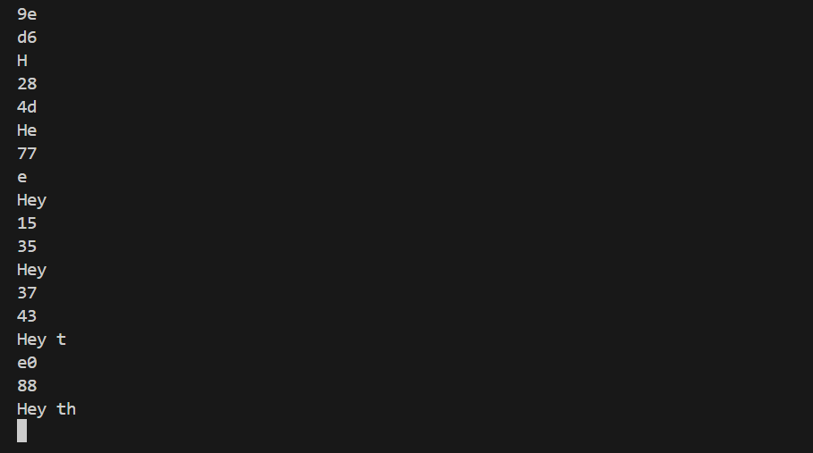

- Nếu mà ngồi nhập chay thì tui sẽ phải thực hiện nhập 715 lần, thế nên chúng ta sẽ thực hiện lọc dữ liệu trong file ra.

    Trước tiên tui sẽ lọc tất cả những dòng có chứa `mov	dword ptr [rbp - 0x10],`, tui thấy có tất cả 715 dòng như thế này. Oce quá ngon lại là con số 715.

    

    Tiếp theo tui sẽ lọc những dòng có `xor	al, `, tui thấy có mỗi 349 dòng như thế này. Mía đến đoạn này nó cấn cấn nhá.

    

    Mía có tận 715 lần nó gọi hàm kiểm tra sao có mỗi 349 lần gọi xor, tui liền xem trong file tiếp thì nó ngoài lệnh xor al ra nó còn có lệnh xor eax nữa (hahahah lừa tình vãi ò luôn).

    

    Tiếp theo tui lịc tiếp những dòng có `xor	eax, `, tui thấy có 362 lần. Mía 362 + 349 = 711 chứ chưa bằng 715. Mía đề lừa tình thì z ò ra nhưng mà đến đoạn này thì tui ko thể mò ra 4 cái dòng kia được thế nên tui cứ thực hiện lọc từ hơn 9000 dòng mã máy kia đã.

    ```python
    str1 = "mov	dword ptr [rbp - 0x10],"
    str2 = "xor	al,"
    str3 = "xor	eax,"

    def copy_lines(input_file, output_file):
        try:
            # Mở tệp đầu vào ở chế độ đọc
            with open(input_file, 'r') as infile:
                # Mở tệp đầu ra ở chế độ ghi
                with open(output_file, 'w') as outfile:
                    # Đọc từng dòng từ tệp đầu vào
                    for line in infile:
                        # Ghi từng dòng vào tệp đầu ra
                        if str1 in line or str2 in line or str3 in line: outfile.write(line)
            
            print(f"Nội dung từ '{input_file}' đã được sao chép sang '{output_file}'.")
        
        except FileNotFoundError:
            print(f"Tệp '{input_file}' không tồn tại.")
        except IOError:
            print(f"Có lỗi xảy ra khi đọc từ '{input_file}' hoặc ghi vào '{output_file}'.")

    # Tên tệp đầu vào và đầu ra
    input_file = 'asm.txt'
    output_file = 'out.txt'
    ```

- Như vậy bây giờ chúng ta mới thực hiện tìm 715 - 711 = 4 lỗi mà máy ko thể nhận được trên file mới (ở những dòng là `199`, `214`, `833`, `1174`). Quá là dễ để phân biệt được luôn. Bây giờ ta sẽ xem những dòng đó là gì mà tự nhiên lại có sự khác biệt đóa.

    

    

    Lúc này ta nhận ra là những câu lệnh ở đây không thực hiện phép xor với một giá trị nào cả mà chỉ đơn thuần thực hiện phép so sánh. Thế nên bh những đoạn đó ta chỉ cần xor nó với `0` là được. Thực hiện sửa file để chỉ còn những dữ liệu như [sau](The_Ultimate_Xor_DONE/text.txt):

    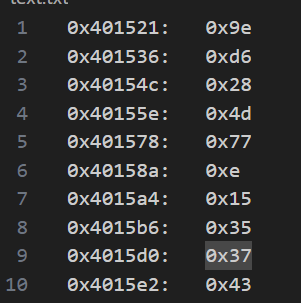

- Sau rùi ta viết sc để đọc thoai:

    ```python
    str1 = "mov	dword ptr [rbp - 0x10],"
    str2 = "xor	al,"
    str3 = "xor	eax,"
    a = []
    b = []
    def extract_hex_value(line):
        # Tách chuỗi theo dấu hai chấm
        parts = line.split(':')
        
        if len(parts) >= 2:
            # Lấy phần sau dấu hai chấm và loại bỏ khoảng trắng
            value_part = parts[1].strip()
            
            # Kiểm tra nếu phần giá trị bắt đầu bằng '0x'
            if value_part.startswith('0x'):
                return value_part
            else:
                return None
        else:
            return None

    def solve(input_file):
        with open(input_file, 'r') as infile:
                i = 0
                for line in infile:
                    tmp = extract_hex_value(line)
                    # print(type(tmp))
                    tmp1 = int(tmp, 16)
                    if i % 2 == 0: a.append(tmp1)
                    else: b.append(tmp1)
                    i += 1

    # Tên tệp đầu vào và đầu ra
    input_file = 'out.txt'

    solve(input_file)
    for i in range(len(a)):
        print(chr(a[i] ^ b[i]), end = '')
    ```

    

    ```txt
    Hey this is the final steps.
    Go further, don't give up!

    Heishiro Mitsurugi is one of the most recognizable characters in the Soul series of fighting games. Mitsurugi made his first appearance in Soul Edge and has returned fo
    for all six sequels: Soulcalibur, Soulcalibur II, Soulcalibur III, Soulcalibur IV, Soulcalibur: Broken Destiny and Soulcalibur V. He also appears as a playable charace ter in Soulcalibur Legends and Soulcalibur: Lost Swords, as He Who Lives for Battle.

    All I need here is a long text, just because I want you to be able to reverse it. I hope you'll learn some good things. Automatizing things can be really good.        

    The flag for this challenge is "I_reverse_all_this_and_all_I_got_is_this_flag"
    ```

- Flag: `KCSC{I_reverse_all_this_and_all_I_got_is_this_flag}`.